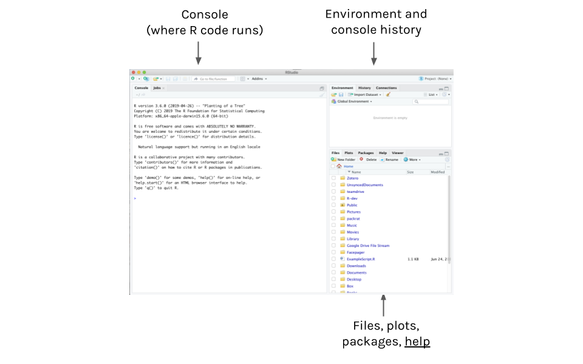
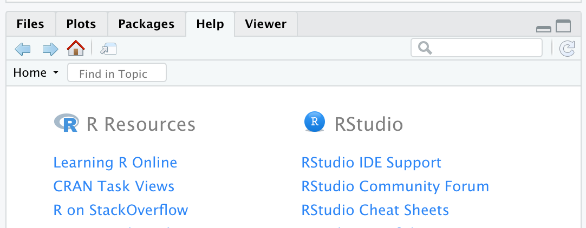
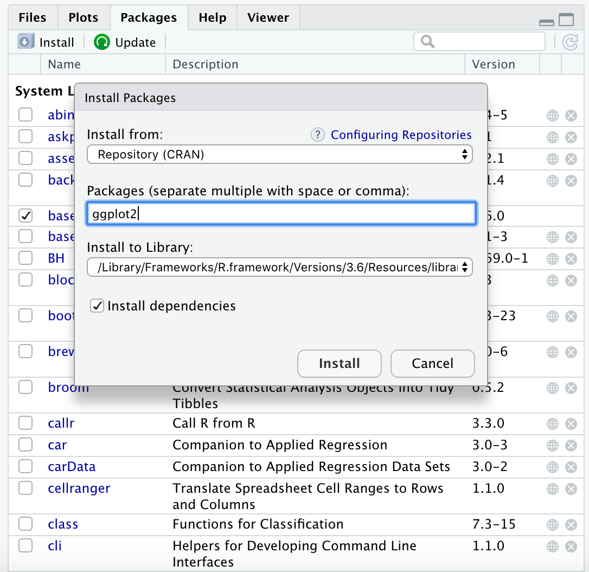
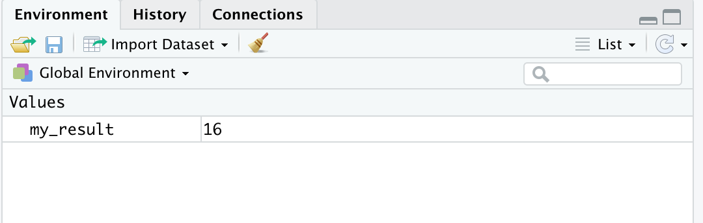
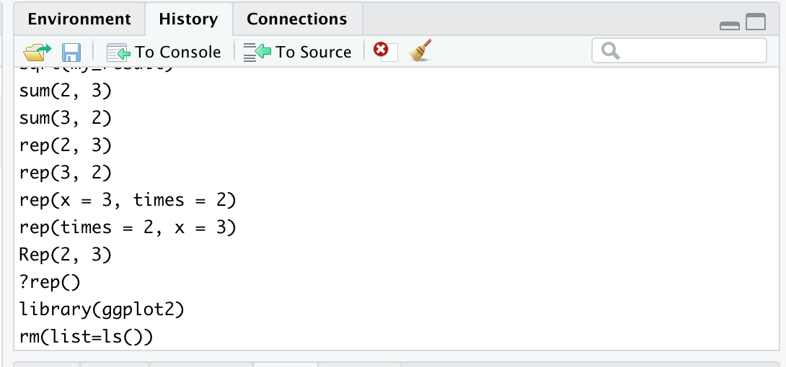
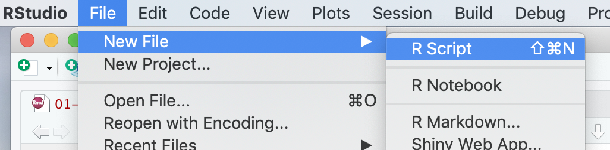
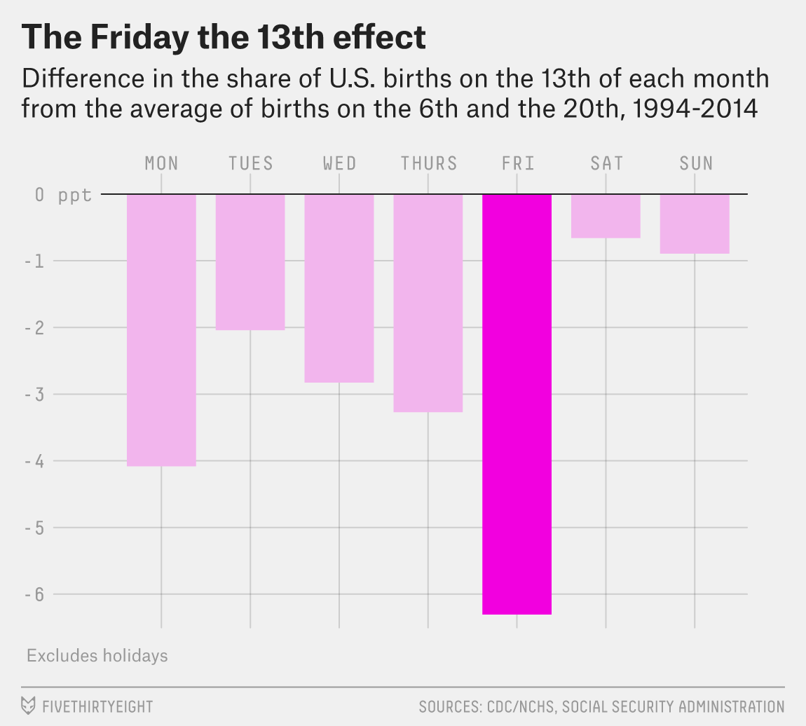

# Introduction to R and RStudio 

*Author: Alicia Hofelich Mohr*

<style>
  .col2 {
    columns: 2 200px;         /* number of columns and width in pixels*/
    -webkit-columns: 2 200px; /* chrome, safari */
    -moz-columns: 2 200px;    /* firefox */
  }
</style>

\
\
\

This workshop is motivated by the increasing need for tools that can be used to elucidate trends, decisions, and stories from data.  This practice is broadly referred to as "data science":


<center>
<div class="image">

<div>source: [Wickham & Grolemund: R for Data Science](http://r4ds.had.co.nz/) </div>
</div>
</center>
\

This workflow is often **iterative** and to ensure we can trust the outcomes, the process between input and output should be **transparent** and **repeatable**. 

\
\


**Workshop Outline & Goals**

Our goal is to provide a hands on introduction to navigating the data science pipeline with R. You will walk away with a solid foundation upon which you can build for your own research.  


\

Day 1:

- Introduction to R & RStudio    
- Reproducibility and R Markdown  
- Data Visualization    
- Simple Data Wrangling and Summaries    


\ 


Day 2: 

- Linear Regression 
- Logistic Regression


\
\
\
\


## Getting Started

No matter what data you are working with, you need *software* to explore and construct inferences from these data.  In this workshop, we'll use the **R** statistical software.  Why R?

- it’s free    
- it’s open source    
- it's flexible / useful for a wide variety of applications    
- it has a huge online community    
- it can be used to create reproducible documents, apps, books, etc. (In fact, *this* document was constructed within RStudio.)

\
\
\

**R and RStudio**

Before this workshop, you were asked to download/update both R and RStudio. 


What's the difference?

```{r, echo=FALSE, out.width="20%"}
knitr::include_graphics("images/R.jpeg")
```

<https://mirror.las.iastate.edu/CRAN/>

* Actual program (engine)
* Can create and run scripts directly in R
* Text editing on a Mac


```{r, echo=FALSE, out.width="20%"}
knitr::include_graphics("images/RStudio-Ball.png")
```

<https://www.rstudio.com/products/rstudio/download/>  

* Integrated Development Environment (IDE) for R
* Text editing for Mac and PC
* Easy integration with R Markdown, Shiny, git, etc

\
\
\
\
\


## R Studio Overview

Here's what you will see when you first open R Studio:

```{r, fig.align="center", echo=FALSE, out.width="120%"}

```


\
\
\
\
\

###  The R console

The R console is where R commands are executed and most output will be displayed. You can type commands directly into the console and run them by pressing "enter".

\
\
\
\

**Using R as a calculator**

We can use R as a basic calculator. Try typing and running each of the following into the console. 

```{r, eval=FALSE}
2 + 3
2 * 3
2^3
(2 + 3)^2
2 + 3^2
```
 
\
\
\
\
\
 
**Assignment**

We can assign and store R output as *objects* in R's environment. This allows us to use or reference the output later. 

\

Store the result of `2 + 3^2` as `my_result`
```{r, eval=FALSE}
my_result <- 2 + 3^2
```
*Tip: press 'cmd+enter' on a Mac and 'cntl+enter' on a PC to create the assign arrow*

Once you create an object, you will see it appear in the "Environment" pane. 

\
\

Check out the result in the console
```{r, eval=FALSE}
my_result
```

\
\

Do something with the results
```{r, eval=FALSE}
my_result + 5
```

\
\

Update the object
```{r, eval=FALSE}
my_result <- my_result + 5

my_result
```

\
\

Object names can not include spaces or start with numbers!
```{r, eval=FALSE}
my result <- 2 + 3^2

1result <- 2 + 3^2
```

\
\
\
\
\

**Functions**

R also has built in *functions* that take in *arguements* and return an output: `function(arguments)`. Arugments can be objects, numbers, or text. 

```{r, eval=FALSE}
sqrt(9)

sqrt(my_result)
```

\
\
\

The sum() function calculates the sum of the listed numbers.  

Does the order of arguments matter?
```{r, eval=FALSE}
sum(2, 3)
sum(3, 2)
```

\
\
\
\

What does the rep() function do? Does the order of arguments matter?
```{r, eval=FALSE}
rep(2, 3)
rep(3, 2)
```

\
\
\


Arguments have names
```{r, eval=FALSE}
rep(x = 3, times = 2)
rep(times = 2, x = 3)
```

\
\
\
\

Is R case sensitive?  eg: Can we spell rep() as Rep()? 
```{r, eval=FALSE}
Rep(2, 3)
```

\
\
\
\
\
\


### The Help window

How do you know what a function does, what arguments are available, and what they are named? Look in the help window!

\
\

You can find the help page for a function by typing the function name in the search bar

```{r, fig.align='center', echo=FALSE}

```

\
\

Or by typing "?" followed by the function name in the console
```{r, eval=FALSE}
?rep()
```

\
\
\


If you are not sure of what a function would be called or whether it exists, a great option is to Google it. 

Some helpful sites include: 

* Stack Overflow: <http://stackoverflow.com/questions/tagged/r>
* R bloggers: <http://www.r-bloggers.com/>
* Quick-R: <http://www.statmethods.net/>

\
\
\
\
\
\
\

### The Package window 

Functions such as `rep()` and `sum()` (along with many others) are built into R's base. These sets of functions are often referred to as "base R". 

However, because R is open source, anyone can contribute extra functions to R (which allow you to do more things) - these extra functions are bundled into "packages" and are typically hosted in the CRAN repository. 

\
\
\
\


To install the package from CRAN to your computer, you can click "Install" in the package tab, which opens a pop-up window. 

```{r, fig.align='center', echo=FALSE}

```

\
\

Or use `install.packages()` in the console

```{r, eval=FALSE}
install.packages("ggplot2")
```


\
\
\


You only need to install packages once for each computer/version of R.

To access the functions in R, you need to load the packages with the `library()` command each time start a new R session. 

```{r, eval=FALSE}
library(ggplot2)
```

\
\
\
\

Note: There are *MANY* ways to do the same thing in R. 

For example, Cronbach's alpha (a common measure of internal scale consistency) is not built into base R. 

* psych package: alpha()
* psy package: cronbach()
* ltm package: cronbach.alpha()
* fmsb package: CronbachAlpha()
* epiDisplay package: alpha()

\
\
\
\
\
\

### The Environment window

Objects we create in R are stored in the Environment tab. If this gets cluttered and you want to "start fresh", you can clear the environment: 

Click on the "broom" icon:

```{r, fig.align='center', echo=FALSE}

```


Or type into the console:
```{r, eval=FALSE}
rm(list=ls())
```

\
\
\
\
\
\

### The History window

This window provides a list of all the commands you have entered in the console

```{r, fig.align='center', echo=FALSE}

```

\
\
\
\
\

While this can serve as a nice reminder of what you have done, think about how well you will remember what all this means tomorrow. Or six months from now. 

\
\
\


For procedures you care about (for example, anything with data), you will want to capture what you do in an *R script*. 


\
\
\
\
\

## R script

To open a new script, select File --> New File --> R Script

```{r, fig.align='center', echo=FALSE}

```


\
\

R scripts 

* Contain R code for a given analysis/project (just as you would type it in the console)
* Include comments (R ignores lines starting with `#`)
* Can be run line by line ("run") or all at once ("source")
* Need to be written in order (i.e., code to create an object needs to come before code that uses the object) 

\
\
\
\
\

Let's prep our R script for data exploration. You can use comments to describe what lines of code do, or as breaks to set apart information about the script from the script itself. 

```{r}
######################################
## Intro to R Workshop 
##  
##  2019-08-14
######################################
```

\
\
\

You can run code from a script in the console by pressing "cmd+enter" (Mac) or "cntl+enter" (PC)
```{r, eval=FALSE}
# Calculate 3 squared
3^2

# Save result to use later
my_result <- 3^2
```

\
\
\
\
\
\


### Working with data


The follow data were used in FiveThirtyEight's article ["Some People Are Too Superstitious To Have A Baby On Friday The 13th"](https://fivethirtyeight.com/features/some-people-are-too-superstitious-to-have-a-baby-on-friday-the-13th/), which analyzes rates of scheduled births on the 13th of the month. 

```{r, fig.align='center', echo=FALSE}

```


This analysis uses the following data:


```{r, warning=FALSE, message=FALSE, echo=FALSE}
pacman::p_load(fivethirtyeight, DT)
data("US_births_2000_2014")
datatable(US_births_2000_2014,  options = list(pageLength = 10))
```


\
\
\
\

**Data Structure**

*Tidy* data tables have two key features:    

1. Each row represents a single **observational unit** of the sample.    

2. Each column represents a **variable**, i.e., an attribute of the cases.    

3. There are no extras in the dataset - no row summaries, column summaries, data entry notes, comments, graphs, etc. All comments about the data collection, variables, etc should be provided in a separate **codebook**.

\
\
\
\


**Question**:  What are the units of observation in the above data?  What are the variables?


\
\
\

**Importing Data**

You can read data into R from a file on your computer, a dataset on the internet, or use data that are included in a package in R. 

Luckily for us, the Friday the 13th data are already stored within R in the `fivethirtyeight` package. 

**IF AND ONLY IF** you did not install the `fivethirtyeight` package before the workshop, you can do so now by typing the following code **in the console**:

```{r, eval=FALSE}
install.packages("fivethirtyeight", dependencies = TRUE)
```

\
\
\

You only need to install a package one time for a given computer and version of R. However, each time you want to use functions or data in a package, you will need to load the package into R. 

Put the following code **in your script**:

```{r}
library(fivethirtyeight)
data(US_births_2000_2014)
```


\

To learn more about this data, you can access **codebook** information:
```{r}
?US_births_2000_2014
```

\
\
\

**Examining data structure in R**

Before we do any analysis, we have to understand the structure of our data. Try each of the following by typing them into your script and running them: 

```{r, eval=FALSE}
# View the data table in a separate tab
View(US_births_2000_2014)

# Check out the first rows in the console
head(US_births_2000_2014)

# Obtain the data dimensions: rows x columns
dim(US_births_2000_2014)

# Get the variable names
names(US_births_2000_2014)

# Look at summary information for each variable
summary(US_births_2000_2014)
```

\
\
\

**Examining specific variables**

```{r, eval=FALSE}
# Access a single variable using "$" 
US_births_2000_2014$year
US_births_2000_2014$month
    
# Determine levels/categories of categorical variables
levels(factor(US_births_2000_2014$year))
levels(factor(US_births_2000_2014$day_of_week))

```


\
\
\
\

**Importing data from other sources**

R can take in data in many different formats, including from proprietary statistical program such as SPSS, SAS, or Stata. However, the most commonly used files are comma delimited. 

* Comma delimited: `read.csv()`
* Tab delimited: `read.delim()`
* Excel files: `library(readxl)`; `read_excel()`
* SPSS files: `library(haven)`; `read_spss()`
* Stata files: `library(haven)`; `read_dta()`
* SAS files: `library(haven)`; `read_sas()`

\
\
\

To read in a data file, assign the output of the `read.csv()` function to an object name. 

```{r}
# Example csv data on women's shoes
shoes <- read.csv(file="https://github.com/IRSAAtUMn/RWorkshop19/blob/master/data/womens-shoes.csv?raw=true")
```


\
\
\
\

You can read in files from your computer by replacing the web address with a file path. 

```{r, eval=FALSE}
# Example csv from computer
shoes <- read.csv(file="~/Documents/MyProject/data/womens-shoes.csv")
```


**Exercises**

Let's apply the above tools to the `bechdel` data in the `fivethirtyeight` package. This data was used in the fivethirtyeight.com's article ["The Dollar-And-Cents Case Against Hollywood's Exclusion of Women"](http://fivethirtyeight.com/features/the-dollar-and-cents-case-against-hollywoods-exclusion-of-women/) which analyzes movies that do/don't pass the **Bechdel test**. 

\

A movie passes the test if it meets the following criteria:    

- there are $\ge 2$ female characters    
- the female characters talk to each other    
- at least 1 time, they talk about something other than a male character


1. Load the data into your environment and examine the codebook information. 

2. View the dataset in a separate tab. 

3. Check out the first 6 cases of the data. 

4. What are the units of observation (rows)? 

5. How many rows/columns does this dataset have?

6. What are the names of the variables?

7. Access the variable `clean_test` alone. What are the levels of this variable?


\
\

Now download the "beers.csv" dataset from https://z.umn.edu/beer-data. This dataset contains information from over 2,000 craft can beers made in the US. 

1. Save the file in a folder on your desktop 

2. Read in this dataset using `read.csv`, saving it as the object `beer`

3. View this dataset in a separate tab

4. Look at the summary information for this dataset


\
\
\
\
\
\

**Solutions:**

```{r, eval=FALSE}
#1. Load the data into your environment and examine the codebook information. 
library(fivethirtyeight)
data("bechdel")
?bechdel


#2. View the dataset in a separate tab.
View(bechdel)


#3. Check out the first 6 cases of the data. 
head(bechdel)


#4. What are the units of observation (rows)? 
# each row = a movie


#5. How many rows/columns does this dataset have?
dim(bechdel)


#6. What are the names of the variables?
names(bechdel)


#7. Access the variable `clean_test` alone. What are the levels of this variable?
bechdel$clean_test
levels(factor(bechdel$clean_test))


## Beers dataset:

#1. Save the file on your desktop
# You will need to determine your computer's file path to that location 

#2. Read in the .csv file
beers <- read.csv("~/Desktop/beers.csv") #on a Mac
beers <- read.csv("C:\Users\[USERNAME]\Desktop\beers.csv") #on a PC

#3. View this dataset in another tab
View(beers)

#4. Look at the summary information for this dataset
summary(beers)

```


