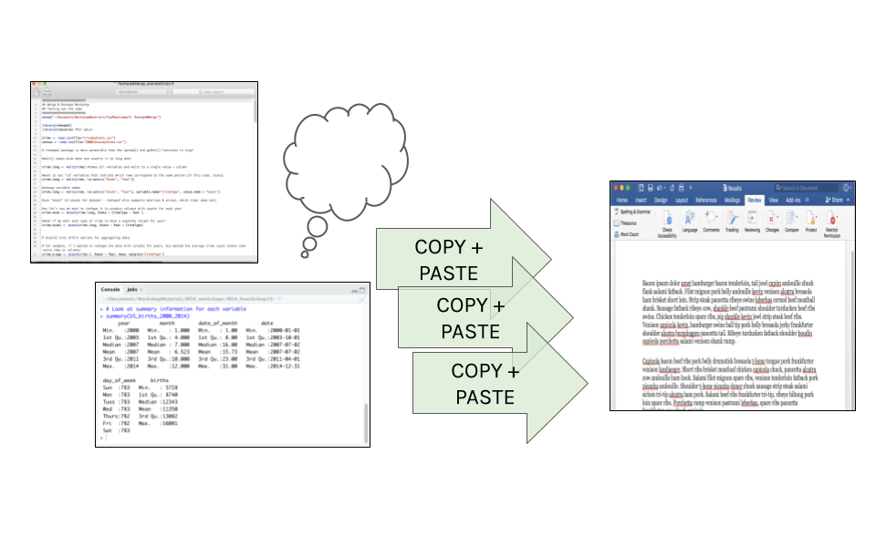
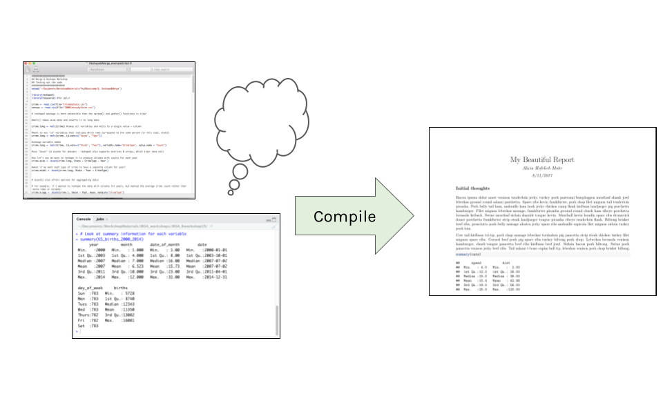
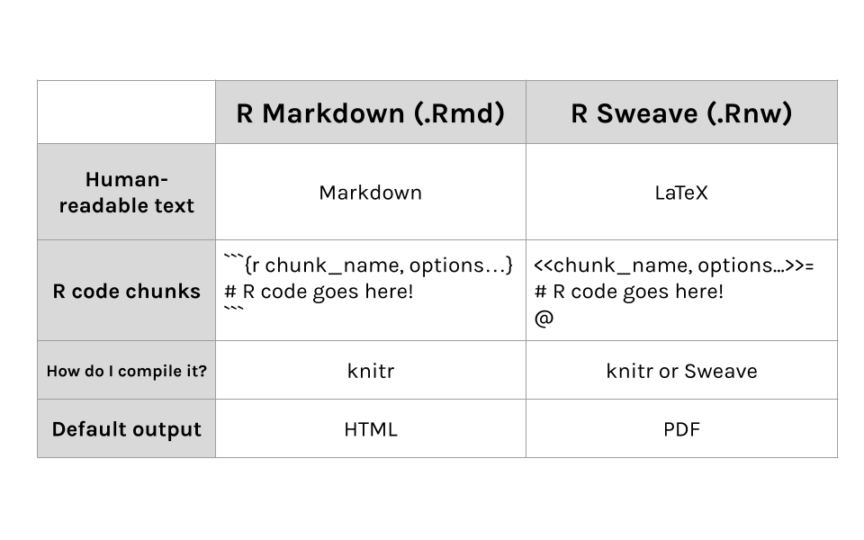
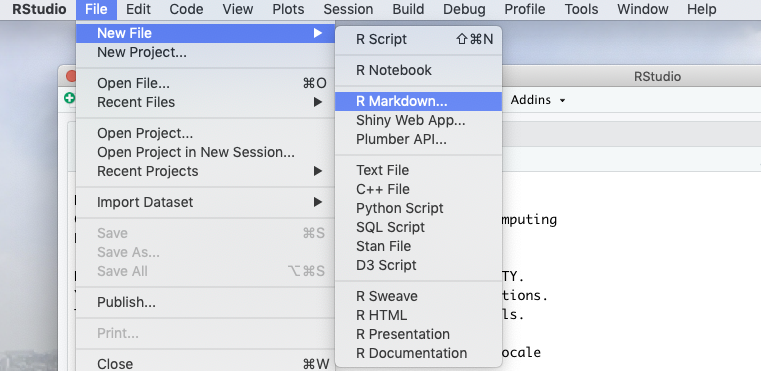
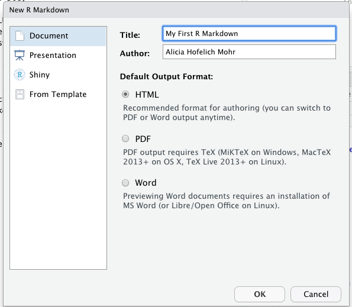
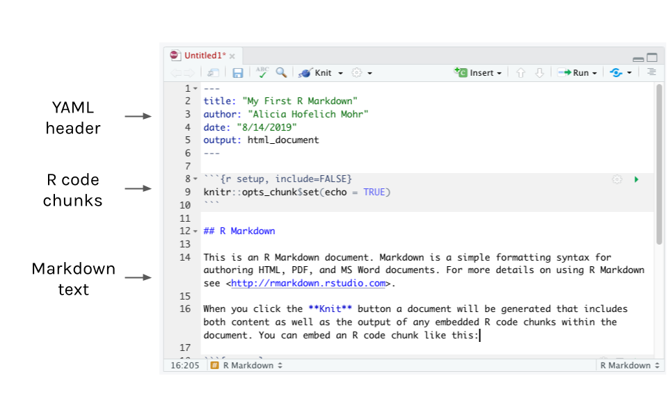
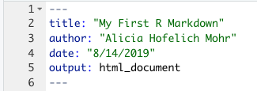
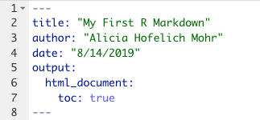
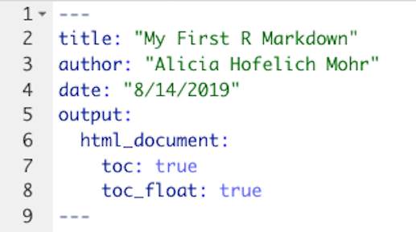

# Reproducible Reports with RMarkdown

*Author: Alicia Hofelich Mohr*

<style>
  .col2 {
    columns: 2 200px;         /* number of columns and width in pixels*/
    -webkit-columns: 2 200px; /* chrome, safari */
    -moz-columns: 2 200px;    /* firefox */
  }
</style>

\
\
\

## Overview of R Markdown


**A not-so-great workflow**

While R scripts contain all the R code you produce in a format that can be easily re-run, they do not include the output or results of your analysis. Comments can be used to describe reactions or intepretations of results, but they are not the best way to present this interpretation in a readable way. 

\
\

Therefore, to use R for data analysis and reporting, you may find yourself engaging in a workflow that involves a lot of copying and pasting (or transcribing) between your R script, console, and a document editor. 

```{r, echo=FALSE}

```


\
\
\
\

**A better way** 

What if there was a better way to run R code, capture output, and present interpretation together?  

```{r, echo=FALSE}

```


There is - R Markdown!


\
\
\

**Reproducible Reports**

R Markdown is a considered a literate programming tool, which is a form of coding that combines text meant for a human to understand with snippets or sections of code for a computer to execute. 

```{r, echo=FALSE}
knitr::include_graphics("images/reproducible-report.png")
```


\
\
\

R Markdown uses Markdown as its human readable text language. Markdown is a straightforward text-to-HTML tool that can format text for the web. This is interspersed with code chunks R can read and execute. 


If you are familiar with the text editing language LaTeX, there is a fully LaTeX option for reproducible reports in R using Sweave. 


```{r, echo=FALSE}

```


\
\
\
\


**In R Studio**

To open a new R Markdown file, go to File --> New File --> R Markdown

```{r, echo=FALSE}

```

\
\
\
\

If you have not yet installed the `rmarkdown` package, you may see a window prompting you to install that package and any related dependencies. If you see this, click to install the required packages. 


Once you have all the packages installed, you will see a pop-up window with various options for the type of R Markdown document and the output. There are many different options for each - in fact, this website was created using R Markdown! 


```{r, echo=FALSE}

```


For this workshop, we will stick with the default options and click ok. 

\
\
\
\

**The .Rmd File**

R will automatically open an R Markdown (.Rmd) file with some example text and code already included. 

An R Markdown file has the following components - YAML, R-code chunks, and Markdown text.

```{r, echo=FALSE}

```


\
\
\
\

To compile the code and text together, press the "knit" button at the top of the file. This will by default open the HTML report in a new window and save a .html file in the folder with the .rmd file. 


\
\
\
\
\

## YAML

The YAML section contains the front matter of your document - title, authors, date, etc. It also controls the formatting of the report output. 


```{r, echo=FALSE}

```

\
\
\

For example, you can add a table of contents to your document:

```{r, echo=FALSE}

```


\
\
\

Or add options to make the table of contents float as you scroll:

```{r, echo=FALSE}

```


There are many other adjustments you can make to the document. The [Definitive Guide to R Markdown](https://bookdown.org/yihui/rmarkdown/) website is a great place to learn about these options.


\
\
\


## Markdown

Markdown is an easy to use text formating language that can be converted to HTML. The markdown portion of the document is where you add in headings, narrative information about the analysis, and any interpretations. 


**Headings**


Markdown
- Try adding levels of headers or a link

R chunks
- Try creating a new chunk 
- Hide the code
- show the code and hide the output

TRY it
- small version of what I had?