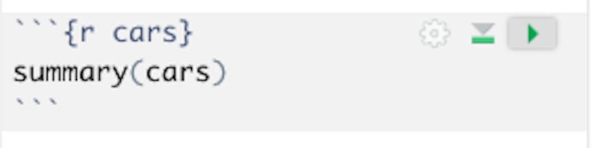

# Reproducible Reports with R Markdown

*Author: Alicia Hofelich Mohr*

<style>
  .col2 {
    columns: 2 200px;         /* number of columns and width in pixels*/
    -webkit-columns: 2 200px; /* chrome, safari */
    -moz-columns: 2 200px;    /* firefox */
  }
</style>

\
\
\

## Overview of R Markdown


**A not-so-great workflow**

While R scripts contain all the R code you produce in a format that can be easily re-run, they do not include the output or results of your analysis. Comments can be used to describe reactions or interpretations of results, but they are not the best way to present this interpretation in a readable way. 

\

Therefore, to use R for data analysis and reporting, you may find yourself engaging in a workflow that involves a lot of copying and pasting (or transcribing) between your R script, console, and a document editor. 

```{r, echo=FALSE, out.height="120%"}
knitr::include_graphics("images/not-a-great-workflow.png")
```


\
\
\
\

**A better way** 

What if there was a better way to run R code, capture output, and present interpretation together?  

```{r, echo=FALSE}
knitr::include_graphics("images/a-better-workflow.png")
```

\
\
\

There is - R Markdown!


\
\
\

**Reproducible Reports**

R Markdown is a considered a *literate programming* tool, which is a form of coding that combines text meant for a human to understand with snippets or sections of code for a computer to execute. 

\

```{r, echo=FALSE}
knitr::include_graphics("images/reproducible-report.png")
```


\
\
\

R Markdown uses **Markdown** as its human readable text language. Markdown is a straightforward text-to-HTML tool that can format text for the web. This is interspersed with **code chunks** R can read and execute. 


If you are familiar with the text editing language LaTeX, there is a fully LaTeX option for reproducible reports in R using Sweave. 


```{r, echo=FALSE, out.height="110%"}
knitr::include_graphics("images/rmarkdown-overview.png")
```


\
\
\
\


**In R Studio**

To open a new R Markdown file, go to File --> New File --> R Markdown

```{r, echo=FALSE}
knitr::include_graphics("images/open-rmarkdown.png")
```

\
\
\

If you have not yet installed the `rmarkdown` package, you may see a window prompting you to install that package and any related dependencies. If you see this, click to install the required packages. 

\
\
\
\

Once you have all the packages installed, you will see a pop-up window with various options for the type of R Markdown document and the output. There are many different options for each - in fact, this website was created using R Markdown! 


```{r, echo=FALSE}
knitr::include_graphics("images/rmarkdown-options.png")
```


For this workshop, we will stick with the default options and click ok. 

\
\
\
\

**The .Rmd File**

R will automatically open an R Markdown (.Rmd) file with some example text and code already included. 

An R Markdown file has the following components - YAML, R-code chunks, and Markdown text.

```{r, echo=FALSE}

```


\
\
\
\

To compile the code and text together, press the "knit" button at the top of the file. This will by default open the HTML report in a new window and save a .html file in the folder with the .rmd file. 


\
\
\
\
\

## YAML

The YAML section contains the front matter of your document - title, authors, date, etc. It also controls the formatting of the report output. 


```{r, echo=FALSE, fig.align='center'}
knitr::include_graphics("images/example-yaml.png")
```

\
\
\

For example, you can add a table of contents to your document:

```{r, echo=FALSE,   fig.align='center'}
knitr::include_graphics("images/example-yaml-toc.png")
```


\
\
\

Or add options to make the table of contents float as you scroll:

```{r, echo=FALSE, fig.align='center'}
knitr::include_graphics("images/example-yaml-tocfloat.png")
```

\
\
\

There are many other adjustments you can make to the document. The [Definitive Guide to R Markdown](https://bookdown.org/yihui/rmarkdown/) website is a great place to learn about these options.


\
\
\


## Markdown

Markdown is an easy to use text formatting language that can be converted to HTML. The markdown portion of the document is where you add in headings, narrative information about the analysis, and any interpretations. 


**Headings**

Headings are indicated with `#`, with the number of `#` corresponding to the header level. 

```{r, echo=FALSE, fig.align='center'}
knitr::include_graphics("images/markdown-headings.png")
```


Try it - Add a new first and second level heading to your example R Markdown file. 


\
\
\
\
\
\

**Text formatting**

For plain text, just type as is. 

* `**` or `__` around words for **bold** text
* `*` for `_` around words for *italic* text
* `[linked text](link-url)` for hyperlinks


```{r, echo=FALSE, fig.align='center'}
knitr::include_graphics("images/markdown-textformat.png")
```

Try it - make a word in the first paragraph of your example R Markdown file bold. 


\
\
\
\

You can also create bulleted lists in Markdown:

```{r, echo=FALSE,  fig.align='center'}
knitr::include_graphics("images/markdown-listformat.png")
```

Try creating a bulleted list in your example R Markdown document. 

\
\
\
\
\


## R chunks

To run and display R code and its output, you'll need to add in an R code chunk. 

```{r, echo=FALSE, fig.align='center'}
knitr::include_graphics("images/rchunks-overview.png")
```


\
\
\
\
\

**Chunk options**

You can specify how you want the R code and output to appear inside the R code chunk. 

```{r, echo=FALSE,   fig.align='center'}
knitr::include_graphics("images/rchunks-options.png")
```

\
\
\
\

Using the `cars` chunk in the example R Markdown file, test what each option does:

* `echo=FALSE`
* `results='hide'`
* `comment=""`

\
\
\
\
\

Chunk options

```{r, echo=FALSE,  fig.align='center'}
knitr::include_graphics("images/rchunks-options2.png")
```

\
\
\
\
\

## Working in R Markdown

Working in R Markdown and R scripts have several *similarities*:

* Within R chunks, run a line of R code by clicking on "Run" or pressing "cmd/cntrl + enter". 
* Order matters - need to create objects before computing on them and load packages before using functions from them. 
* Need to have objects present in your environment in order for R code to work in console

\
\

However there are some *differences*:

* When "knit", all the R code is run in separate session 
* Objects created in one chunk are available to use in later chunks
* You can run all the code in a single chunk by pressing the green triangle button on the right side of the chunk

```{r, echo=FALSE, fig.align='center'}

```


\
\
\
\


**Exercises**

Revisit the `bechdal` data exploration exercises from the previous session. 

This time, we will create an R Markdown document with these findings. You can start fresh in a new R Markdown document, or use the existing one you have been modifying. 

* Start by creating separate R chunks for each exercise question
* Write the question above each chunk in Markdown
* Put the R code for the exercise in an R code chunk (remove the comments - that will be in the Markdown above)
* Write a sentence interpreting the result below each chunk in Markdown
* Knit the document to produce your report


